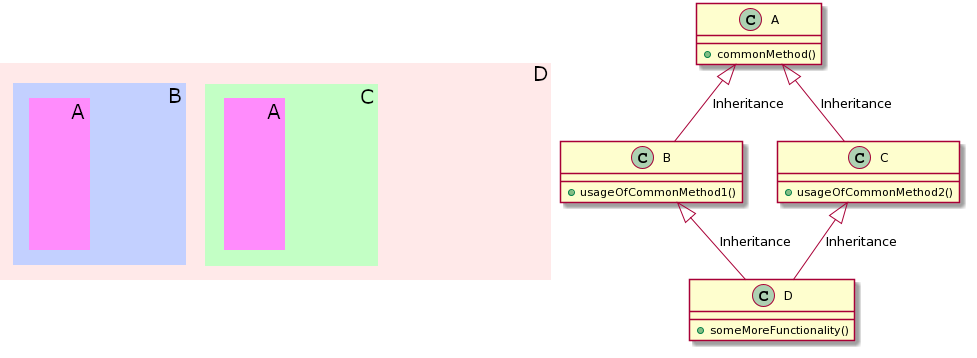
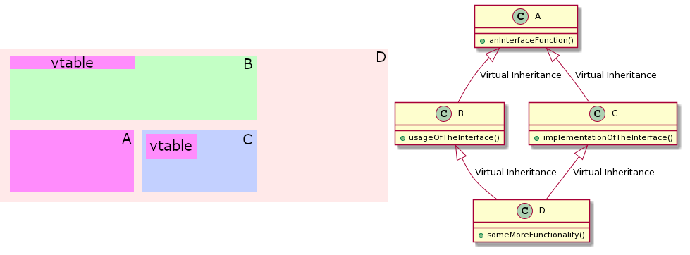

# 2. Object model in C++
Most of nowadays' popular programming languages have some sort of classes and inheritance. As with nearly everything else, C++ goes further.

C++ does not distinguish between interfaces and regular classes and allows multiple inheritance even from parents with the same ancestor. Features to deal with all the pitfalls are provided, but they are not always so straightforward. Mastering these will enhance your OOP to a level that Java developers never even dreamed of.

---
## Class types
There are four types of classes:
* Value class - holds several values, may have methods to manipulate its own data
* Polymorphic class - has a lot of functionality, polymorphic classes hold most of the program's code (it does not need to be literally polymorphic to belong here)
* Manager class - manages the access and lifetime of other objects
* Relationship class - defines a relationship between objects, not usable alone and owns nothing

Sometimes, a class does not belong into any of those, but it's rare. C++ is somewhat designed to determine where does the class belong and generate copy/move constructor/assignment operators appropriately.

**Exercice:** Where do belong the following classes? `std::string`, `std::vector`, `std::vector::iterator`, `std::ifstream`, `std::thread`

---
## SOLID principles and when to violate them
SOLID principles are rules of thumb that help avoid later code duplication and technical debt. You probably know them, so I'll run through it quickly.
* Single Responsibility Principle - the hardest to maintain, the easiest to violate
* Open-Closed Priciple - encapsulation and suitability for inheritance, usually a no brainer
* Liskov Substitution Principle - violated when a parent class reveals what subclass it is, not trivial to violate, troublesome if violated
* Interface Segregation Principle - not very different from Single Responsibility Principle
* Dependency Inversion Principle - because it's annoying to deal with petty details on every level and changing half of the codebase when changing basics

Obeying them dogmatically or ignoring them leads to the LIQUID principles (Low in Quality, Unmatched in Desolation).

---
### Single Responsibility / Interface Segregation Principle
Once your program has a lot of classes, they will often share a lot of functionality. Any shared functionality implies they should have a common parent that provides that functionality. Code that is duplicated across multiple files is extremely difficult and bug prone to change. But you probably know this. But it can get more complex.

---
Some of following advice can be happily ignored if the code is performance critical.
* It happens that the implementation of some interface is a load of one-liners - consider implementing them in the parent class using a child class' method or some structure prepared in children's constructor
* It happens that a part of the functionality is common among many children, but not all - depending on the situation, either give the parent a default implementation or create a class between the children and the parent that implements this sometimes shared functionality
* It happens that child methods share some functionality - depending on the situation, either make it a method of the parent class that calls a virtual method specialised by children or a make the childen's methods call a parent method under different conditions
* It happens that some functionality is repeated within one class - use composition, calls may contain more symbols, but it will be possible to iterate over these parts or use lambdas to benefit from the shared functionality also when using the class

---
Single responsibility principle also applies to functions, if some of them share certain functionality or some part of a functionality is somewhat separate, there should be an additional function that provides it and is called internally.

If some program parts separated because of the Single Responsibility Principle are used together often, don't hesitate to join them. If a pair of functions is called often in sequence but sometimes individually, create a function that calls them both. If it happens too often that a class inherits from the same group of classes, feel free to create a class that inherits from that group of classes and inherit only from that one.

---
### Dependency Inversion Principle
If class A is used by class B, no class used by class A should use class B. It's not possible without forward declaration anyway. Violating this rule causes longer compilation times and leads to further violations of SOLID principles.

However, it happens that object A needs to use object B while object B uses object A. It can usually be solved by changing the program's structure:
* You can have three classes. Class A is used by class B, class B is used by class C that also inherits from A.
* When class B uses class A, it inserts a lambda (wrapped in `std::function`) into it and class A calls it

---
### When to violate them
* Value classes often don't need encapsulation. Any class with too many setters and getters is badly designed and may need a value class with all the properties accessed by a single function (it may also be a private parent class).
* Manager and relationship classes can have circular dependencies. It often happens that such a class is used logically as one class, but in the program, it's actually a group of classes. A group of cooperating classes should use the `friend` declaration to access each other's private members, keeping them inaccessible to everything outside.
* Adherence to the Single Responsibility Principle can also be overdone. If too much code is needed to separate what seems to be two responsibilities, they might not really be two responsibilities. Small functionality can also be repeated if more code is needed to use it than to reimplement it.

---
Basically any rule can be violated if it will sufficiently shorten the code, but these violations should be properly documented, encapsulated and combined with compile time and run time checks to prevent accidental misuse

---
## Constructor and destructor

This functionality is chiefly called _RAII,_ which stands for _Resource Acquisition is Initialisation,_ a hard to comprehend name that doesn't really describe what it is for (Bjarne Stroustroup himself admitted that).

It means that when an object is created, one of its constructors is called and when it goes out of scope, its destructor is called.

---
A constructor is called when a stack-allocated object is created, when a member object is created, when dynamic memory pointing to the object is allocated or when a temporary object is created.

A destructor is called:
* When a stack allocated object goes out of scope
* When a parent object containing the object is destroyed
* When the last smart pointer pointing to the object is destroyed
* When `delete` is called
* Right after the line where a temporary unnamed object is used
```C++
{ // Memory allocated
    dint += 15;
    std::string strink("stronk"); // Constructor with an argument "stronk" is called
    dint -= 15;
} // Destructor called, memory deallocated
```

---
Both constructor and destructor can be avoided by creating a different object like `std::array<uint8_t, sizeof(A)>` (with appropriate size) and using `reinterpret_cast` to get a reference to the actual object. This is rarely useful. Possible uses are writing a vector-like structure (for example for vectorising tree-like structures), creating custom allocators and such.

---
Since C++11, a constructor can call (delegate) other constructors of the same class. This is useful when there are many constructors that aren't simple enough. Typically, this leads to implementing additional constructor functionality to one constructor and having other constructors delegate it.

```C++
struct A {
  int a;
  int b;
  A(int a) : a(a), b(2) {
  }
  A() : A(1) {}
};
```

A less known fact is that in the initialisation section, only parent classes and members can be initialised, so constructor arguments can have the same names as members even if arguments take precedence over member names. However, this might not be the best idea for long constructors, because any attempts to change members after the initialisation will change only the arguments (some compilers warn about it).

---
A constructor can be called on a prepared area of memory using the so called _in-place constructor._
```C++
std::array<uint8_t, sizeof(std::string)> strArray;
std::string* made = new (&strArray) std::string("Hello, cruel world!");
```
To destroy the string (and release its dynamically allocated contents) without attempting to deallocate stack-allocated memory, it's necessary to explicity call the destructor:
```C++
made->~basic_string<char>(); // Needs the full name of the class
```
This should not be called on properly allocated objects, because the destructor would be called again when their memory is deallocated.

---
### Constructor types
What is the order of initialisation of the individual parent classes, of the member variable and the printing?
```C++
struct QuantumComputer : Quantum, Computer {
    std::string _name;
    std::string _manufacturer;
    QuantumProcessor(std::string name, int id)
        : Quantum(id), Computer(id), _name(name), _manufacturer("Loolge") {
        std::cout << "Made one, won the Nobel prize!" << std::endl;
    }
};
```

---
Custom constructors tend to be the most known because they are the most commonly written. First are parent classes initialised (from left to right), then members (from top to bottom) and finally the body of the constructor is executed.

But there are special constructor types that may act somewhat differently.

---
#### Default constructor
If the constructor takes no arguments, it's the default constructor. A default constructor is called when the object is created implicitly:
```C++
{
    std::string stunk; // Default constructor called
}
```
Parent classes and member classes are default initialised unless their constructor arguments are explicitly stated (if they cannot, they need the arguments stated explicitly). If they can all be default constructed and there is no custom constructor, the default constructor does not have to be defined explicitly.

---
#### Copy constructor
If the constructor takes a const reference to a class of the same type, it's a copy constructor. A copy constructor is called when the object is created from another instance.
```C++
void stench(const std::string& stink) {
    std::string stunk = stink; // Copy constructor called
}
```
Parent classes and member classes are copy constructed from respective parts of the argument unless their constructor arguments are explicitly stated. If they can all be copy constructed, the copy constructor often does not have to be defined explicitly.

---
#### Move constructor
```C++
PisPNproof(PisNPproof&& other) {
```
A move constructor is called when the object is created from another instance that is not const and cannot be used afterwards (temporary or return value). It can be forced by calling `std::move` on it.
```C++
void stench(const std::string& stink) {
    std::string stunk = stink + "-washed";
    // Move constructor called on the value returned by the operator+
}
```
The move alllows implementing a `std::unique_ptr` and similar structures that can be moved but not copied, making their use much less error prone. The destructor will still be called, so the object must be left in a state the destructor can deal with.

Parent classes and member classes are move constructed from respective parts of the argument unless their constructor arguments are explicitly stated. If they can all be move constructed, the move constructor usually does not have to be defined explicitly.

---
#### Other constructors

* Conversion - takes a const reference to a different class as the only argument, allows implicit conversion from another type (`A(const B& other);`)
* Move conversion - a move constructor that takes a different type (`A(B&& other);`)
* Custom - anything else

Conversion constructors can be turned into normal constructors (that won't be called implicitly) can be done using the `explicit` keyword. Use it if you don't mean to define implicit conversions, it will save you from a lot of need to use explicit language later.

---
### Access control
It can be useful to make constructors private at times - it can restrict the construction to static methods and friend classes. To avoid writing the constructor's body when only its encapsulation is set, you can use the `default` keyword.
```C++
private:
    ChainConnector() = default;
    ChainConnector(const ChainConnector&) = default;
```
To completely prevent a constructor from being called, use the `delete` keyword:
```C++
    ChainConnector() = delete;
    ChainConnector(const ChainConnector&) = delete;
```
This will make the object impossible to create (instances can be faked with `reinterpret_cast`).

---
### Exercise
Write a class that manages parallel access to another class. It uses a `std::shared_mutex` to offer a method that provides const access the object it manages (one method) or another method that provides modifiable access.

---
## Default value
This can be allowed to change the way members are constructed by the default or custom constructor (not copy or move):
```C++
struct SwitchController {
    Device* parent = nullptr; // Guarantees no constructor can leave it uninitialised
    bool on = false;
};
```
To supply more than once constructor argument, another instance must be created and copied to it:
```C++
struct SchmidtElectricSwitch : SwitchController {
    std::vector<float> voltages = std::vector<float>(3, 5);
};
```
This usually needs more code than mentioning it in a constructor, so it might not always be the best thing to do.

---
## Default value and inheritance
Functions and methods can also be used to provide suitable return values to construct the objects. Methods are particularly useful, because they have access to `this`. Preferably use only methods inherited from the parent, because only the parents and members above are initialised when initialising a member. Accidentally accessing a member below the initialised one means accessing uninitialised memory.
```C++
struct BrakeConfig : Configurable {
    Configuration<std::string> name = conf("name");
    Configuration<int> maxSpeed = conf("max_speed");
};
```
Although it wasn't yet explained how to implement this, it shows how can a member variable be given access to `this` so that it could register itself for serialisation or some RPC access or something.

---
## Polymorphism and RTTI
A class with at least one virtual method starts with a pointer to a static structure that identifies it (virtual table and _RTTI_ or _RunTime Type Information_). Any such object's class can thus be identified.
```C++
std::cout << typeid(whoami).name() << std::endl;
```
The `typeid()` keyword will obtain an instance of `std::type_info` that can be used to obtain the type's name, a unique number representing it (`hash_code()`) or can be compared. Use this sparingly, it helps violate the Liskov substitution principle.

---
The most usual case of using the pointer to class information is to allow a class to be properly destroyed while being used as its parent class.

Every class that could be inherited from and cast back to parent class should have a virtual destructor. If a function _doesn't_ have a virtual destructor and its descendant is converted to it and destroyed as the parent class, the destructors of the descendant's members will not be called, possibly causing incorrect behaviour (mostly memory leaks). STL classes except streams and exceptions _don't_ have virtual destructors, so don't inherit from them (unless you really know what you are doing).

```C++
virtual ~PQRG() = default;
```
This will cause the destructor of the actual class to be called, followed by the destructor of its parent, its parent's parent etc. I am just repeating this because it's easy to forget. Any inheriting class will have a virtual destructor, even if not explicitly declared.

It may be useful to declare a class without a virtual destructor as `final`.

---
Another crucial use of this functionality is to select the right virtual method (the pointer points to a table containing pointers to the actual methods that will be called by the virtual method calls). You do know this, of course.
```C++
virtual void abdicate() = 0;
virtual void iAmBack() {
    abdicate(); // The descendant will abdicate()
    _id = "Imperator Tiberius Iulius II";
}
```
It's essential when avoiding hard to extend constructs like this:
```C++
void iAmBack() {
    if (_id == "Imperator Trullus Gaelicius")
        gaeliciusAbdicated();
    else if (_id == "High King Rumulus XIII")
        romulusAbdicated();
    _id = "Imperator Tiberius Iulius II";
}
```

---
During construction, the virtual table pointer points to the table of virtual functions of the class being constructed at that moment, not the class that would be constructed in the end. It's a good thing, because it often prevents accessing uninitialised data.

Calling functions that are purely virtual in that class will fail.

```C++
struct Device {
    virtual Version version() const = 0;
    virtual std::string id() const {
        return "Demo device";
    }
    Device()  {
        std::cout << "Created device " << id(); // Overrides don't apply
        std::cout << " version " << version() << std::endl; // Call will fail
    }
};
```

---
Calling virtual functions is slower than calling normal ones and they can be implemented wrongly in the descendant, breaking the program. Only those functions that are meant to be overriden at least in some children should be declared virtual.

---
## Multiple inheritance
If a class inherits from two parents classes that inherit from a common parent class, each will contain its own instance of the parent class.



---
More exactly said, if class `B` inherits from class `A`, class `C` also inherits from class `A` and class `D` inherits both from `B` and `C`, class `D` will contain two instances of `A`, one accessible as `B::A` and the other as `C::A`. Accessing methods or members of `A` through `D` requires prefixing it with `B::` or `C::` to specify whose `A` it belongs to. Alternatively, it can be converted to `B` or `C` before using it as `A`.

If class `B` inherits from class `A` and class `C` inherits both from `A` and `B`, there is no way for `C` to access its direct base `A`.

Try it out [here](https://repl.it/repls/UnnaturalElasticDimension).

---
## Virtual inheritance
Virtual inheritance causes a common parent class to be inherited only once. In practice, there are often better solutions, so it is useful only in rare occasions.


---
```C++
struct Moving : virtual public Component {
  std::pair<float, float> _range;
  float _maxSpeed;
  explicit Moving(Configuration*);
};
```

Try a full example [here](https://repl.it/repls/SafeSufficientWatchdog).

---
Because the common parent object cannot be initialised twice, calling a parent class' constructor will not call its parent class' constructor and the child class will have to do that. In other words if class `B` virtually inherits from `A` and class `D` inherits from class `B` while the constructor of `B` calls the constructor of `A`, calling the constructor of `B` from class `D` will **not** call the constructor of class `A` and the class `D` has to call the constructructors of both `A` and `B`.

---
### Mixins
Mixins are commonly used to avoid code duplication in languages that don't allow multiple inheritance. In C++, this is rarely needed, but it can be implemented using virtual inheritance if necessary.



---
Suppose that a very commonly used class `A` has a virtual method. Another commonly used class, `B`, inherits from `A`. Many classes share a common implementation of the virtual method of `A`, but it's not common enough to put it in `A` or `B`. To prevent all these classes from implementing it separetely, another common ancestor is needed. In many cases, having a class `C` inherit from `B` is enough, but it's not always suitable (there might be more such methods with various combinations of common implementations, while splitting `A` to more classes would not fit).

In this case, it's suitable to use a mixin. A mixin class `C` would inherit from `A` and implement the virtual method. If a class `D` inherits from `B` and `C`, it receives the virtual method from `A`'s implementation from `C`. All inheritance must be virtual in this case.

Try it out [here](https://repl.it/repls/DelectableSmartLight).

---
### Exercise
Use a mixin to create the following group of classes:
* Class `IDevice` is an interface with one method that allows some kind of communication
* Class `IDeviceWithSavedData` is an interface inheriting from `IDevice` that adds a method to read a ROM on the device
* Class `BFG9000` that implements the `IDevice` interface (use whatever simplification you want)
* Class `BFG10000` that implements the `IDeviceWithSavedData` interface, using the implementation of `IDevice` of `BFG9000`

---
### Homework
You have a base class called `Device` that manages access to a hardware device connected through some protocol. There is a group of devices that have random subsets of these capabilities:
* Device has accessible EEPROM memory with some internal data stored as pairs of strings (or whatever else as it fits you)
* Device can measure its chip temperature
* Device has a certain output voltage set and can measure its real output voltage and current
* Device amplifies a signal according to the requested amplification
* Device manages other devices

Implement a simple imitation of the `Device` classes as it fits you. Then create classes for the specific hardware properties that use the `Device` class to provide methods for setting values on devices. Finally, implement classes representing specific devices that have subsets of these capabilities inheriting from their respective classes.
